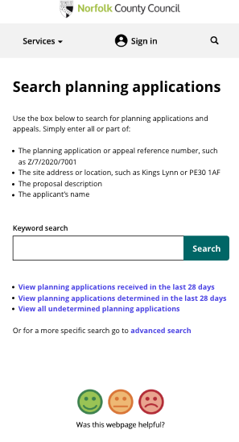
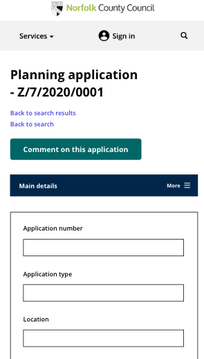

## The Challenge

Norfolk County Council had recently switched over to a new build of MasterGov and had received complaints from the general public about the UX of the current register. Especially on mobile, the website didn't adapt to the viewport of the device, making it difficult to use.

## Key Questions

When I was tasked with improving the design, I wanted to go one step further after analyzing the old website. Some of the key questions I wanted to answer were:

- How much of the current register was a good UX?
- Which features were working well?
- Was the desktop viewport optimal?
- Were there any specific pages or areas of the website that users were complaining about?
- What elements of the register were creating confusion or hesitation among users?

## Timeline

Q1 2021 - Q2 2021

## Roles

- Design lead
- UX research/demos

## Time-Constrained Research

Norfolk County Council needed the register quickly, as they were about to go live with the new MasterGov updates in Q2 of 2021. To combat this constraint, I decided to reach out to Norfolk directly to ask about any complaints, reviews, or times they've spoken to the general public. I spoke with Nick, a senior planning officer from Norfolk, and he directed me to the web team who knew about the complaints.

_The old register_

Many of the pain points users were hitting were mainly on mobile, but the website also had severe accessibility issues that were preventing some members of the public from using the register at all.

_The page to access the old register_

## Exploring Ideas

One of my biggest gripes with the old register (and backed up by the research the web team did) was that when a user landed on the register, they were presented with all these fields that they did not know of. This created confusion, and I pointed out that many members of the public tend to think in terms of their address or the application number if they have it on hand.

_User journeys and stories_

_Initial ideas drawn up_

## Design Solution

My proposed solution was to collaborate with the web team at Norfolk to run user testing on the dev environment while we review the prototypes internally. As this would allow us to deliver the project on time.

Aside from cleaning up the UI, one of my major ideas was to replace the many fields on the search page with a single search bar that would be capable of searching for addresses and application numbers. By having one search bar on the screen, users would feel confident knowing they won't have to fret about putting the wrong information in the wrong field. By empowering the field with the ability to search for not just address but application number, I hypothesized that this would still give choice to the user whichever way they wanted to search.

For users who were knowledgeable about planning applications and required more complex, filtered search capabilities, we implemented an advanced search option.

_High fidelity design of the simplified search screen_

_High fidelity design of advanced search_

## Results

Upon the developers building my prototype and running a test environment with members of the council and members of the public, the designs were a big success. We saw a number of users who expressed delight in finding their application within a couple of taps on their mobile device, and a few ward officers who were glad we didn't remove the advanced search capabilities.

The new design significantly improved accessibility and the user experience, addressing the concerns of the general public.

_Mobile design of the search screen_

_Mobile design of the application page_
